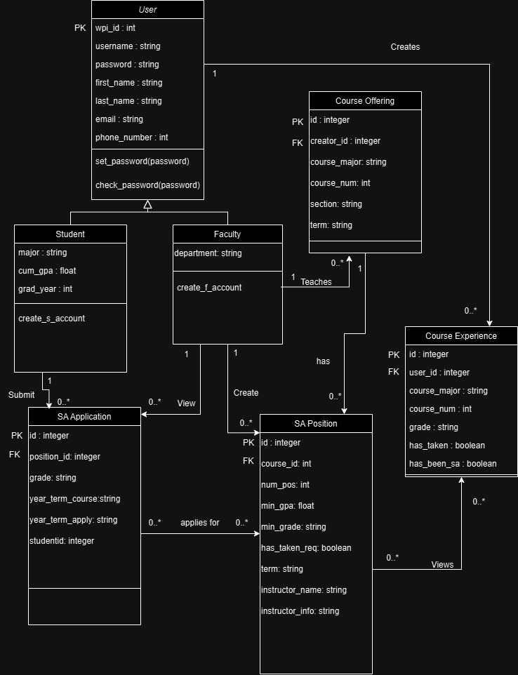
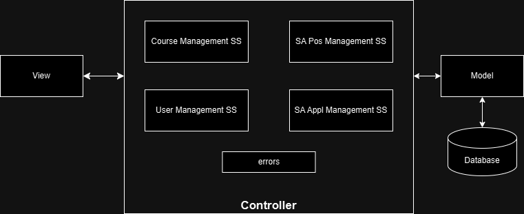

# Project Design Document - draft
## SA Connect: "Streamlining the Student Assistant Recruitment Process"
--------
Prepared by:
* `Harleen Kaur`,`BME and RBE`
* `Julian Kreis`,`CS`
* `Jed Geoghegan`,`CS & DS`
* `Jacob Lu`,`IMGD & CS`
---
**Course** : CS 3733 - Software Engineering
**Instructor**: Sakire Arslan Ay
---
## Table of Contents
- [1. Introduction](#1-introduction)
- [2. Software Design](#2-software-design)
- [2.1 Database Model](#21-model)
- [2.2 Subsystems and Interfaces](#22-subsystems-and-interfaces)
- [2.2.1 Overview](#221-overview)
- [2.2.2 Interfaces](#222-interfaces)
- [2.3 User Interface Design](#23-view-and-user-interface-design)
- [3. References](#3-references)
- [Appendix: Grading Rubric](#appendix-grading-rubric)

### Document Revision History
| Name | Date | Changes | Version |
| ------ | ------ | --------- | --------- |
|Revision 1 |2024-11-15 |Initial draft | 1.0 |
| | | | |

# 1. Introduction
This document describes the design of the Student Assistant Recruitment System for the WPI Computer Science Department. The purpose of this system is to manage student assistant (SA) applications, position creation, and assignment to students. This document provides a detailed software design including the database model, subsystem architectures, and user interface designs. This is the first revision, and we plan to add more specific details and examples in future drafts.

# 2. Software Design

## 2.1 Database Model

Classes
- User: The base class that stores common information for both students and instructors
- Student: stores information specific to students
- Faculty: stores information specific to faculty
- Course Offering: stores course offering details
- Course Experience: stores data about a student's previous experience in a course
- SA Position: stores details of available SA positions
- SA Application: stores details of SA applications

UML Diagram:
<kbd>
      
</kbd>

## 2.2 Subsystems and Interfaces

### 2.2.1 Overview

Major subsystems:
- User Management Subsystem: ensures that both students and faculty can securely log in, access their profiles, and perform actions based on their role (student or faculty)

- Course Management Subsystem: responsible for managing course details, including course names, sections, and terms. It ensures that SA positions are linked to the correct course and course section.

- SA Position Management Subsystem: responsible for managing the creation, modification, and removal of student assistant (SA) positions. Faculty members can create SA positions by associating them with specific courses and defining the number of positions available.

- SA Application Management Subsystem: responsible for managing the student application process for SA positions. It enables students to apply for positions, track their application statuses, and withdraw applications.

UML Component:
<kbd>
      
</kbd>

### 2.2.2 Interfaces

#### 2.2.2.1 \<User Management SS> Routes
| | Methods | URL Path | Description |
|:--|:------------------|:-----------|:-------------|
|1. | POST | /users/student/register/ | registers a new user |
|2. | POST | /users/student/login/ | authenticates and logs in user |
|3. | GET | /users/student/logout	| ends a user session |
|4. | GET | /users/student/profile | retrieves the profile information of the logged-in user |
|5. | POST | /users/student/editprofile| edits a student's profile |
|6. | POST | /users/faculty/register/ | registers a new user |
|7. | POST | /users/faculty/login/ | authenticates and logs in user |
|8. | GET | /users/faculty/logout	| ends a user session |
|9. | GET | /users/faculty/profile | retrieves the profile information of the logged-in user |
|10. | POST | /users/faculty/editprofile| edits a faculty's profile |

#### 2.2.2.2 \<Course Management SS> Routes
| | Methods | URL Path | Description |
|:--|:------------------|:-----------|:-------------|
|1. | POST | /course/create |creates a new course |
|2. | POST | /course/<course_id>/edit|edit an existing course |

#### 2.2.2.3 \<SA Pos Management SS> Routes
| | Methods | URL Path | Description |
|:--|:------------------|:-----------|:-------------|
|1. |POST | user/faculty/courses/create SA positions | create SA positions|
|2. |POST | user/faculty/courses/edit SA positions |edit SA positon |
|3. |GET | user/faculty/positions|displays list of all SA positions created|
|4. | GET | user/student/courses/applications/recommendations	| retrieves a list of recommended positions for the student based on interest |
|5. | GET | user/faculty/courses/applications/recommendations for faculty	| retrieves a list of recommended positions for each course for faculty member |

#### 2.2.2.4 \<Applications Management SS> Routes
| | Methods | URL Path | Description |
|:--|:------------------|:-----------|:-------------|
|1. | POST | /course/create |creates a new course |
|2. | POST | /course/<course_id>/edit|edit an existing course |

### 2.3 User Interface Design

Page Tempates: 
- Staff: Main page shows courses they've created, can open dropdown under each course that shows applicants and applicant info. Each course also has an edit button to go to an edit course form Create course page Edit course form

- Student: Main page shows courses they can apply to, including a separate relevant courses section Separate page to view application status

- Both: Login Page Profile creation page Edit Profile (Student will need more info)

User Stories:

- Student: 1-7
- Staff: 8-12
- Both: 1 and 8

1. As a student, I want to create an account using my WPI credentials so that I can log in an apply for SA positions.  
2. As a student, I want to view all SA positions so that I can choose positions of interest.  
3. As a student, I want to view a list of recommended positions so that I can find relevant opportunities.  
4. As a student, I want to view a detailed description of a position so that I can understand the requirements for each course.  
5. As a student, I want to apply to SA positions so that I can get a job.  
6. As a student, I want to view the status of my applications so that I can track my SA application progress. 
7. As a student, I want to withdraw my application for a SA position so that I can change my decision to be a SA.  
8. As faculty, I want to create an account using my WPI credentials so that I can log in and hire students. 
9. As faculty, I want to add courses with open SA positions so that I can add positions.  
10. As faculty, I want to add open SA positions for my courses so that I can begin the hiring process.  
11. As faculty, I want to view student applications so that I can review qualifications and hire applicants.  
12. As faculty, I want to assign SA positions based on student applications and qualifications, ensuring each student is only assigned to a single position.  

# 3. References
