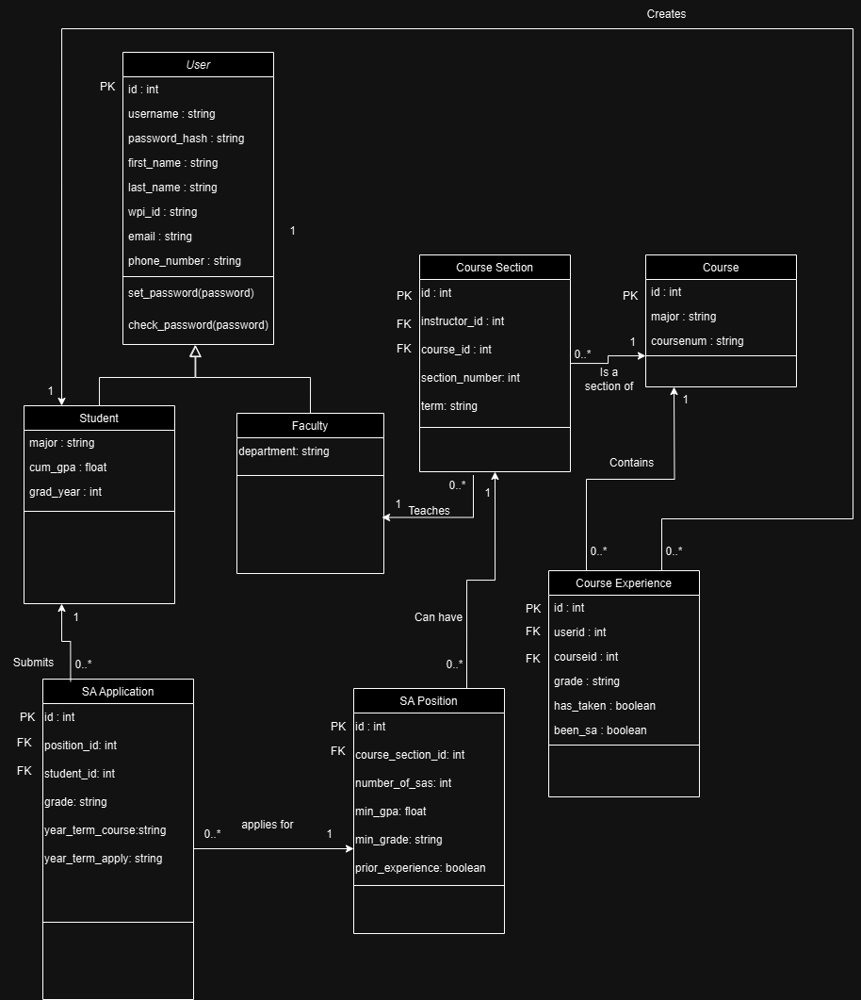
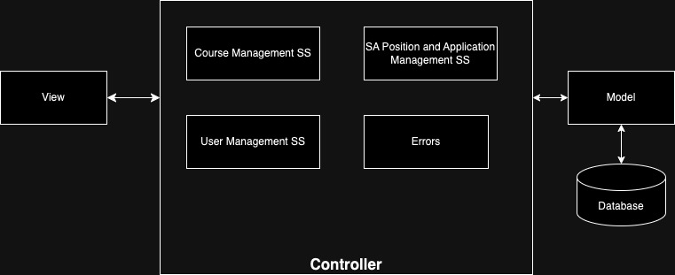
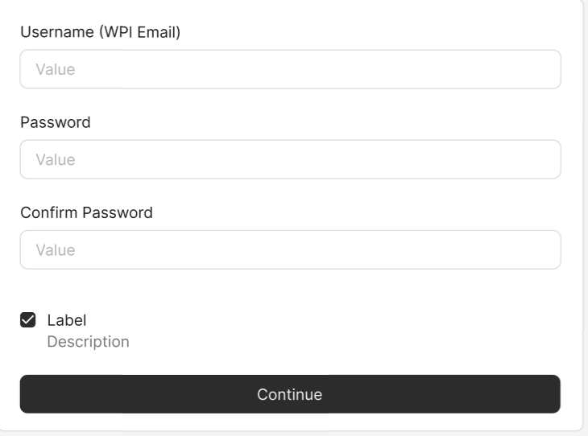
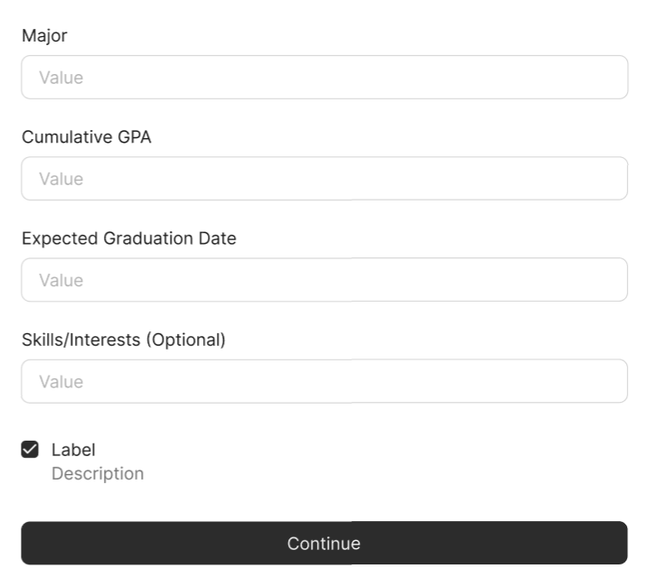
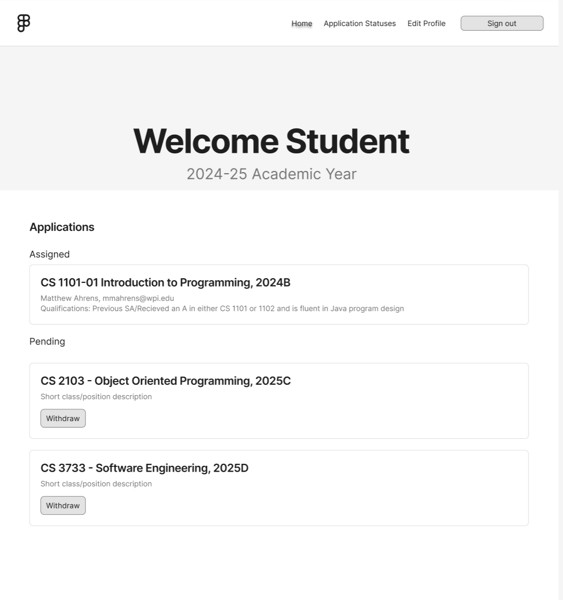
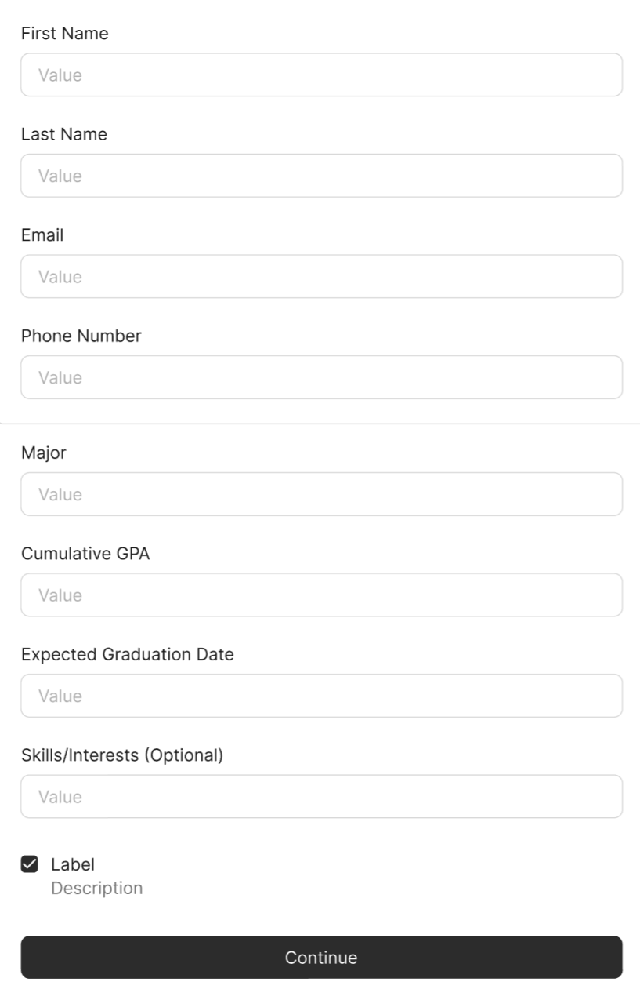
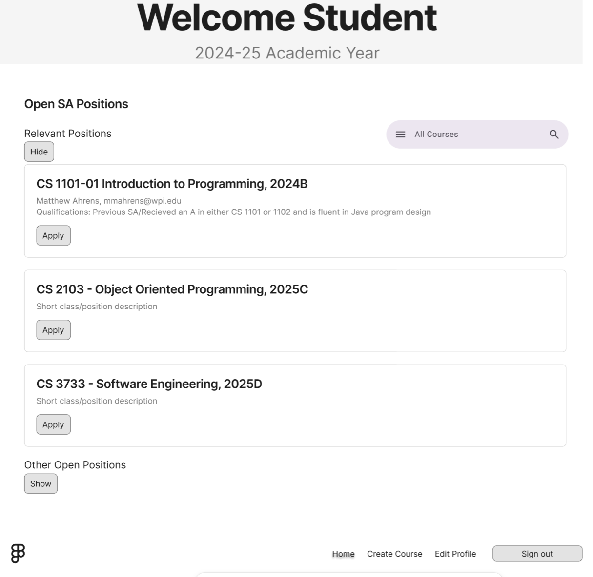
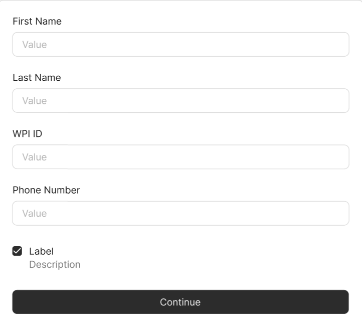

# Project Design Document - Final
## SA Connect: "Streamlining the Student Assistant Recruitment Process" 

--------
Prepared by:
* `Harleen Kaur`,`BME and RBE`
* `Julian Kreis`,`CS`
* `Jed Geoghegan`,`CS & DS`
* `Jacob Lu`,`IMGD & CS`
---
**Course** : CS 3733 - Software Engineering
**Instructor**: Sakire Arslan Ay
---
## Table of Contents
- [1. Introduction](#1-introduction)
- [2. Software Design](#2-software-design)
- [2.1 Database Model](#21-model)
- [2.2 Subsystems and Interfaces](#22-subsystems-and-interfaces)
- [2.2.1 Overview](#221-overview)
- [2.2.2 Interfaces](#222-interfaces)
- [2.3 User Interface Design](#23-view-and-user-interface-design)
- [3. References](#3-references)

### Document Revision History
| Name | Date | Changes | Version |
| ------ | ------ | --------- | --------- |
|Revision 1 |2024-11-15 |Initial draft | 1.0 |
|Revision 2 |2024-11-21 |Final draft |2.0 |

# 1. Introduction

This document describes the design of the Student Assistant Recruitment System for the WPI Computer Science Department. The purpose of this system is to manage student assistant (SA) applications, position creation, and assignment to students. This document provides a detailed software design including the database model, subsystem architectures, and user interface designs. This is the first revision, and we plan to add more specific details and examples in future drafts.

# 2. Software Design

## 2.1 Database Model

Classes
- User: The parent class to Student and Faculty. Includes information that is needed for both students and faculty, that being their id, username, password_hash, first_name, last_name, wpi_id, email, and phone_number. Also contains functions that will be used by both the Student and Faculty class, those being set_password() and check_password().
- Student: A child class of User, stores information specific to students, that information being their major, cum_gpa, and grad_year.
- Faculty: A child class of User, stores information specific to faculty, that being their department.
- Course: Stores the data of a course, that being its id, major, and coursenum.
- Course Section: Stores the information for course sections. This includes the course_id for the course the Course Section is a section of, the instructor_id of the user that created the course section, the section_number of the course section, and the term the course section is held in.
- Course Experience: Stores data about a student's previous experience in a course. Stores the userid of the student that created it, the courseid of the course that the student is recording their experience in, the grade the student had in the the course, whether or not the student has_taken the course, and whether or not the student has been_sa for the course.
- SA Position: Stores details of available SA positions which includes the course_section_id of the course that the SA Position is for, the number_of_sas that can be assigned to the position, as well as the min_gpa and min_grade required of the applicants and whether or not the applicant needs prior_experience in the course.
- SA Application: Stores details of SA applications including the position_id of the position the application is for, the student_id of the student that created the application, the grade the student got when they took the course, the year_term_course for the year and term they took the course, and the year_team_apply for the year and term they are applying for SAship.

UML Diagram:
<kbd>
      
</kbd>

## 2.2 Subsystems and Interfaces
### 2.2.1 Overview

Major subsystems:
- User Management Subsystem: ensures that both students and faculty can securely log in, access their profiles, and perform actions based on their role (student or faculty)

- Course Management Subsystem: responsible for managing course details, including course names, sections, and terms. It ensures that SA positions are linked to the correct course and course section.

- SA Position and Management Subsystem: responsible for managing the creation, modification, and removal of student assistant (SA) positions. Faculty members can create SA positions by associating them with specific courses and defining the number of positions available. It will also be responsible for managing the student application process for SA positions. It enables students to apply for positions, track their application statuses, and withdraw applications.

UML Component:
<kbd>
      
</kbd>

### 2.2.2 Interfaces

#### 2.2.2.1 User Management SS Routes
| | Methods | URL Path | Description |
|:--|:------------------|:-----------|:-------------|
|1. | GET, POST | /student/register | registers a new user |
|2. | GET | /student/profile | retrieves the profile information of the logged-in user |
|3. | GET, POST | /student/editprofile | edits a student's profile |
|4. | GET, POST | /faculty/register | registers a new user |
|5. | GET | /faculty/profile | retrieves the profile information of the logged-in user |
|6. | GET, POST | /faculty/editprofile | edits a faculty's profile |
|7. | GET, POST | /login | authenticates and logs in user |
|8. | GET | /logout | ends a user session |

#### 2.2.2.2 Course Management SS Routes
| | Methods | URL Path | Description |
|:--|:------------------|:-----------|:-------------|
|1. | GET, POST | /course/create | creates a new course |
|2. | GET, POST | /course/<course_id>/edit | edit an existing course |

#### 2.2.2.3 Application & Position Management SS Routes
| | Methods | URL Path | Description |
|:--|:------------------|:-----------|:-------------|
|1. | GET, POST | /faculty/create | create SA positions|
|2. | GET | /faculty/positions | displays list of all SA positions created |
|3. | GET, POST | /faculty/<position_id>/edit | edit SA positon |
|4. | GET | /student/positions | displays list of all available SA positions |
|5. | GET | /student/recommendations | retrieves a list of recommended positions for the student based on interest |

### 2.3 User Interface Design

Page Templates: 
- Staff: Index page shows courses they've created, can open dropdown under each course that shows applicants and applicant info. Each course also has an edit button to go to an edit course form. Create course page, Edit course form.

- Student: Index page shows courses they can apply to, including a separate relevant courses section. Separate page to view application status

- Both: Login Page, Profile creation page, Edit Profile (Student will need some info than what is stored in faculty)

#### Faculty Page Components:
<kbd>

</kbd>

#### Student Page Components:
<kbd>

      
      
      
      
</kbd>

User Stories:
- Student: 3-9
- Staff: 13-17
- Both: 1-2, 10-12, 18

1. As a student, I want to create an account using my WPI credentials so that I can log in an apply for SA positions.  
2. As a student, I want to login with username and password provided during create account
3. As a student, I want to view all SA positions so that I can choose positions of interest.  
4. As a student, I want to view a list of recommended positions so that I can find relevant opportunities.  
5. As a student, I want to view a detailed description of a position so that I can understand the requirements for each course.  
6. As a student, I want to apply to SA positions so that I can get a job.  
7. As a student, I want to view the status of my applications so that I can track my SA application progress. 
8. As a student, I want to withdraw my application for a SA position so that I can change my decision to be a SA.  
9. As a student, I want to have "assigned" SA positions be disabled for withdrawal so I can't withdraw from "assigned" positions.
10. As a student, I want to edit my profile so that I can change my personal information 
11. As faculty, I want to create an account using my WPI credentials so that I can log in and hire students. 
12. As faculty, I want to login with username and password provided during create account
13. As faculty, I want to add courses with open SA positions so that I can add positions.  
14. As faculty, I want to add open SA positions for my courses so that I can begin the hiring process.  
15. As faculty, I want to view student applications so that I can review qualifications and hire applicants.  
16. As faculty, I want to assign SA positions based on student applications and qualifications, ensuring each student is only assigned to a single position. 
17. As faculty, after interviewing a student, I would like to update the status of their application from “Pending” to "Assigned" so that I can hire them for the position. 
18. As a faculty, I want to edit my profile so that I can change my personal information 

# 3. References

----